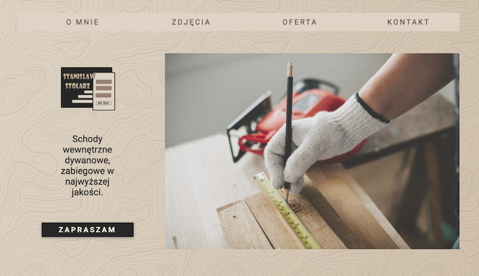
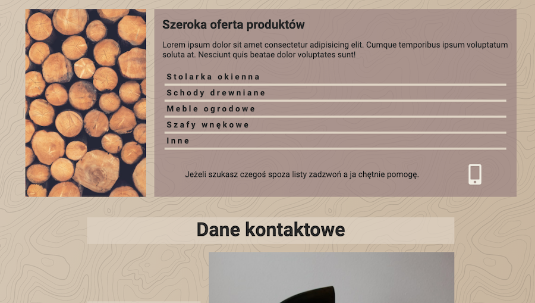
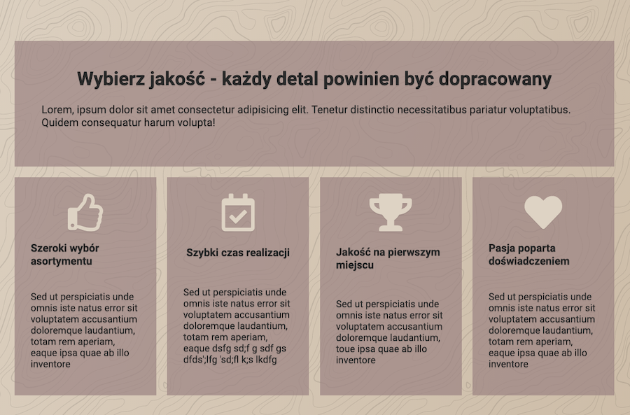
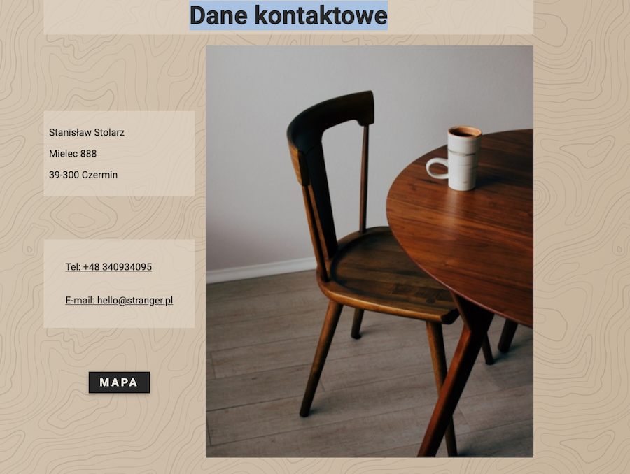

# Stanisław Stolarz

A project which I've made when I start learning code. Simple, fully responsive website with a fast time loading page. It has a lightbox script for the image gallery.

## Features

- lightbox scirpt,
- fast time loading page,
- fully responsive,
- etc.

## Under the hood

Technologies being used under the hood:

- Vanillia JS
- Sass
- HTML

## Screenshots

### License

MIT

---

Made with [@gregsypek](https://twitter.com/@gregsypek) 2021
